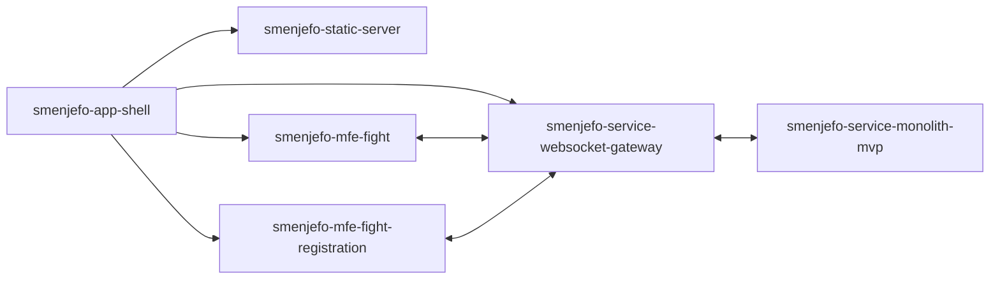

# Smenjefo

"Smen-je-fo" - that's what we called the game "rock-paper-scissors" with the boys in the yard when I was a child :) This is a game that both adults and children know and love!

**But why not breathe new life into this game?** What about team fights? Or what about an extended system of moves like "super-scissors" etc? ) System of health and energy points, clan tournaments, role system, chat for players?.. WOW!!!

Inspired by [https://www.youtube.com/watch?v=ey5ucWw9GZE](https://www.youtube.com/watch?v=ey5ucWw9GZE) ^_^

---

## Gameplay

Here you can watch some short videos of first prototypes

### "Duel" mode fight


https://user-images.githubusercontent.com/23284240/171448433-74c6a320-510b-4229-a85f-d22ddebb024d.mov


### "Team on team" mode fight

https://user-images.githubusercontent.com/23284240/171448517-7d4628b9-fb41-468a-940f-46c6b8a6b07b.mov


---

## Game Rules

Game rules are developed in a [separate repository](https://www.github.com/smenjefo/game-rules-obsidian) in the form of Obsidian's "Vault".

---

## Run app via Docker Compose

> **Working configuration:**  
> Node version: 16+  
> Npm version: 8+  
> Docker version: 17+  
> Docker-Compose version: 1.14+  
> OS: Mac / Win  


All routing settings you can see in the [.dev.env](./.dev.env) file, please make sure that ports on your machine are not busy. If you need override ports, you can make changes to the env file + changes to the [docker-compose.yml](./docker-compose.yml) file for relevant apps.

By default, client runs on **3000** port.

### Build and run app


Install all packages in the root dir

```shell
$ npm i
```

Then you need to build all applications via Nx 

```shell
$ npm run build:all:dev
```

Then you may run all apps via docker-compose:

```shell
$ docker-compose up
```

### Real-time development

For real-time development with **HMR** required to serve all instances by Nx, but Nx somehow runs only 3 instances (Work in progress..).

---

## Architecture

### General description



**smenjefo-app-shell**

This is the host application of all MFE applications. Loading carried out dynamically. App shell also initialize websocket instance and passes it to loaded MFE instances.

**smenjefo-mfe-fight**

Fight page MFE

**smenjefo-mfe-fight-registration**

Fight registration page MFE

**smenjefo-service-websocket-gateway**

Websocket application which proxying client MFEs and server-side

**smenjefo-service-monolith-mvp**

Monolith rest http server for mvp stage

**smenjefo-static-server**

Just store static files like css-styles or images. Will be replaced with nginx after mvp phase.

### Communication between MFEs

MFEs can communicate with each other only via an in-memory message bus. Message bus instance is located on the app-shell side and passed to each MFE and then MFE decides whether a message bus subscriber should be created or not.

MFEs can also communicate indirectly via websocket, but this channel is supposed to serve only "large" business logic operations (on the backend).
