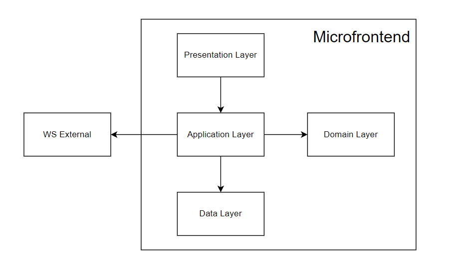
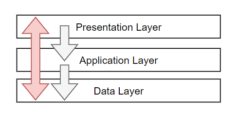

# MFE Fight

This is the React app responsible for the Fight page as a separate microfrontend.

---

## Architecture

The application has an experimental Layered Architecture :) 

Divided into four layers, dependency arrows are shown in the figure and must be strictly observed!

### Presentation Layer

Contains the entire React application with its entire ecosystem, responsible for rendering the battle page and executing the UI business logic.

### Application Layer

This layer is responsible for all dispatching of the app. Communicates with the outside world through the websocket (as well as the message bus), converts the data received from the websocket into Domain layer entities or Data layer models. Provides services for Presentation layer.

### Domain Layer

The domain layer centralizes and describes the high-level business logic of the application. Separated and independent.

### Data Layer

Responsible for storing application data and provides mechanism for interacting with the data store like Repositories and Models. Data storage located in memory.

### How reactivity is implemented

If you look at the picture above, the arrows are located in the same direction from Presentation Layer to Data Layer. This means there is no reactivity:

- a player clicks on the button, calling some service method from Application Layer
- Application Layer save somthing to Data Layer
- and... that's it

We need such functionality that would redraw Presentation layer when the data changes inside Data Layer. In other words, we need MVVM... :)

To do this, I had to use an "Architecture sinkhole" anti-pattern:

Presentation Layer subscribes to changes of the Data Layer through Application Layer, but this is the only exceptional case, therefore it is considered the norm, since it satisfies the 80-20 rule.

---

## Dictionary (Ubiquitous language)

### Fight

Fight is thing this app was made for :) Consist of Rounds

### Round

Consist of Turns

### Round Result

| Word                                      | Description   |
| -----------                               | -----------   |
| Completed Round Result                    | -             |
| InProgress Round Result                   | -             |

### Turn

Turn means Players pair (Turn Initiator and Turn Target) with Turn Direction between and Turn Types on both sides. This is the part of the whole Round.

Player in the context of Turn can be Turn Initiator or Turn Target

| Word                                      | Description   |
| -----------                               | -----------   |
| Turn Initiator                            | -             |
| Turn Target                               | -             |

Turn Direction defined by “reciprocity” of Turn Initiator and Turn Target 

| Word                                      | Description                                                               |
| -----------                               | -----------                                                               |
| Turn Direction                            | -                                                                         |
| Mutual Turn Direction                     | Turn Initiator and Turn Target made Turn Types to each other              |
| Unidirectional Turn Direction             | Turn Initiator made Turn Type, but Turn Target chose another Turn Target  |
| Self Turn Direction                       | Turn Initiator made Turn Type to himself                                  |

### Relationship

Relationship between Turn Initiator and Turn Target in the fight :)

| Word                                      | Description                                               |
| -----------                               | -----------                                               |
| Relationship                              | -                                                         |
| Teammate Relationship                     | Turn Initiator and Turn Target belong to the same Team    |
| Enemy Relationship                        | Turn Initiator and Turn Target belong to different Teams  |
| Self Relationship                         | Turn Initiator and Turn Target is the same Player         |

### TurnType

General name of any kind of turn type

| Word                                      | Description                                                                 |
| -----------                               | -----------                                                                 |
| TurnType                                  | -                                                                           |
| Rock                                      | belongs to Attacking TurnType Category, belongs to any Player Role          |
| Scissors                                  | belongs to Attacking TurnType Category, belongs to any Player Role          |
| Paper                                     | belongs to Attacking TurnType Category, belongs to any Player Role          |
| SuperRock                                 | belongs to Attacking TurnType Category, belongs to **Maniac** Player Role   |
| SuperScissors                             | belongs to Attacking TurnType Category, belongs to **Maniac** Player Role   |
| SuperPaper                                | belongs to Attacking TurnType Category, belongs to **Maniac** Player Role   |
| HandOfHelp                                | belongs to Helping TurnType Category, belongs to **Comrade** Player Role    |
| Donor                                     | belongs to Helping TurnType Category, belongs to **Comrade** Player Role    |
| Cheat                                     | belongs to Defensive TurnType Category, belongs to **Rogue** Player Role    |
| Skip                                      | belongs to System TurnType Category, belongs to any Player Role             |

### TurnType Category

Any TurnType belongs to a certain Category

| Word                                      | Description                                                 |
| -----------                               | -----------                                                 |
| TurnType Category                         | -                                                           |
| Attacking TurnType Category               | Rock, Scissors, Paper, SuperRock, SuperScissors, SuperPaper |
| Helping TurnType Category                 | HandOfHelp, Donor                                           |
| Defensive TurnType Category               | Cheat                                                       |
| System TurnType Category                  | Skip                                                        |

### Player

Player is the main character of the Fight

### PlayerHP and PlayerEnergy

Health points and energy points of the Player

### Player Role

The player's role defines a set of additional "non-traditional" TurnTypes

| Word                                      | Description                           |
| -----------                               | -----------                           |
| Player Role                               | -                                     |
| Maniac Player Role                        | SuperRock, SuperScissors, SuperPaper  |
| Comrade Player Role                       | HandOfHelp, Donor                     |
| Rogue Player Role                         | Cheat                                 |

### Player TurnStatus

Player's turn status during Turn

| Word                                      | Description   |
| -----------                               | -----------   |
| Player TurnStatus                         | -             |
| Player InProgress TurnStatus              | -             |
| Player Completed TurnStatus               | -             |

### Player Status

Player's status during Fight

| Word                                      | Description     |
| -----------                               | -----------     |
| Player Status                             | -               |
| Player InGame Status                      | -               |
| Player Eliminated Status                  | -               |

### TurnWindow

TurnWindow is a set of TurnType for Turn Initiator, also it has own TurnWindow Status

| Word                                      | Description   |
| -----------                               | -----------   |
| TurnWindow Status                         | -             |
| Opened TurnWindow Status                  | -             |
| Closed TurnWindow Status                  | -             |

### Turn History

...

### Team

...