# Websocket Gateway

Mediator between "Client" front-end application and "Monolith MVP" back-end. Based on Socket.IO library and Redis.

---

## Responsibilities

At the moment it also might implements the "Backend For Frontend" logic (temporary for MVP phase).

It is supposed to be behind a reverse proxy.

---

## Scaling

Websocket Gateway implements [Redis adapter](https://socket.io/docs/v4/redis-adapter/) and is ready to scale.

---

## Routing

### Fight Registration

**loadFightApplications**

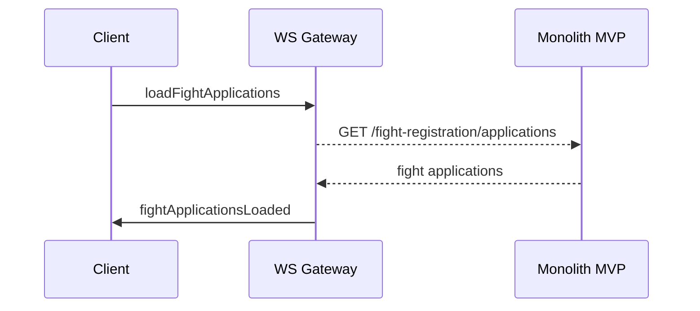

---

**loadFightApplication**

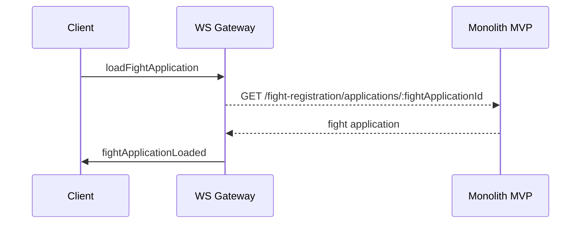

---

**removeFightApplication**

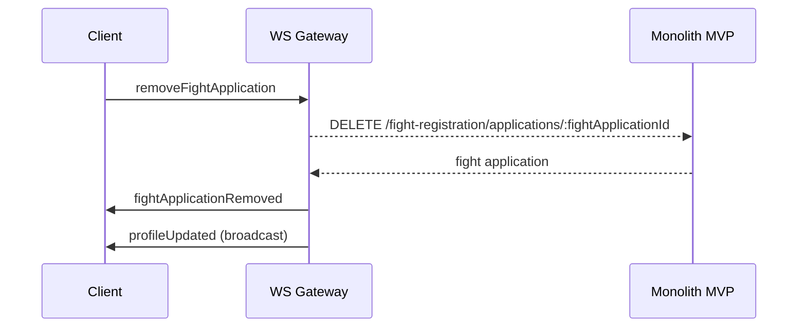

---

**createFightApplication**

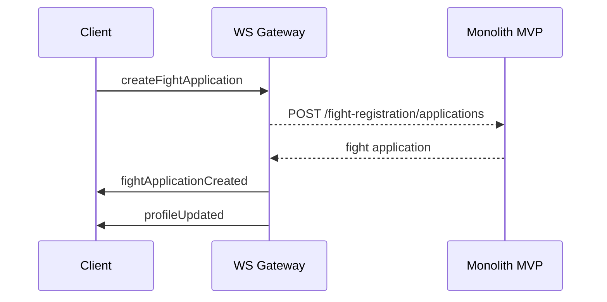

---

**addPlayerToFightApplication**

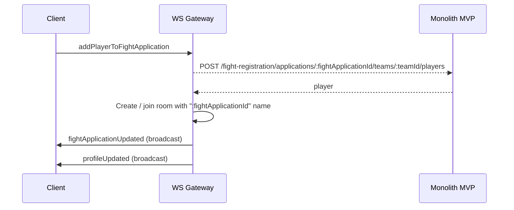

---

**removePlayerFromFightApplication**

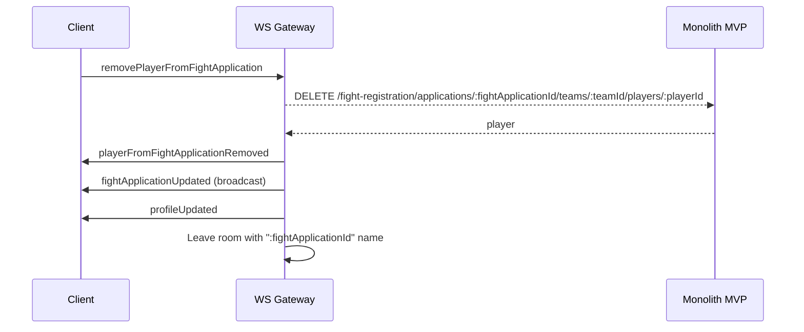

---

### Fight

**initializeFight**

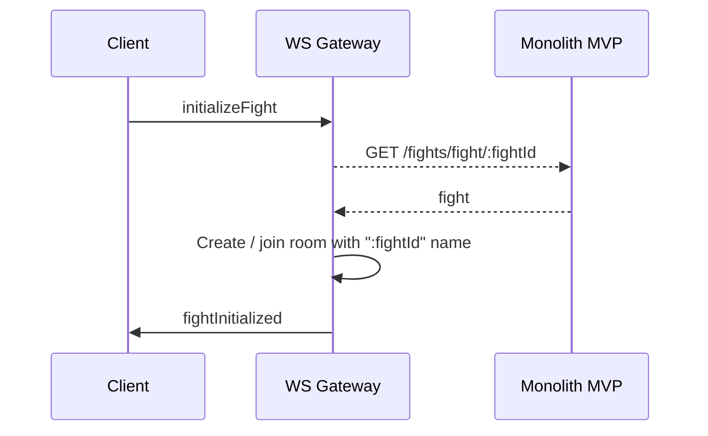

---

**loadFightRound**

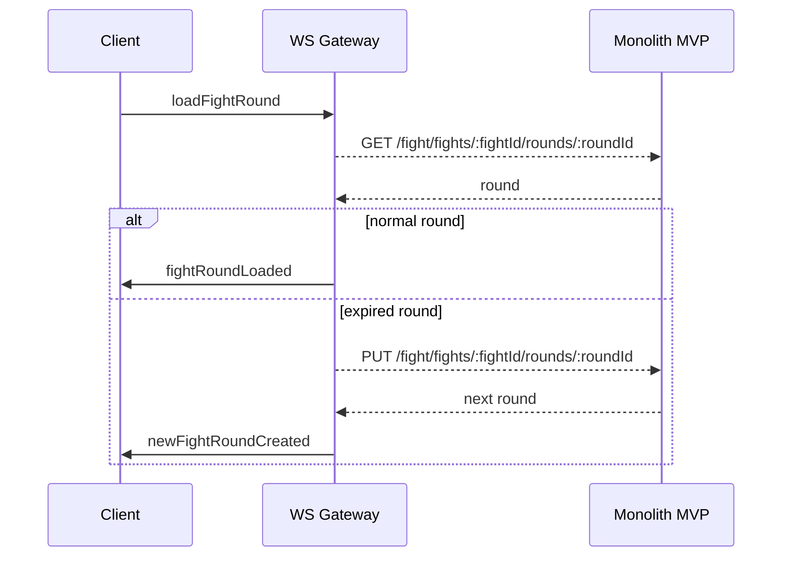

---

**makeTurn**

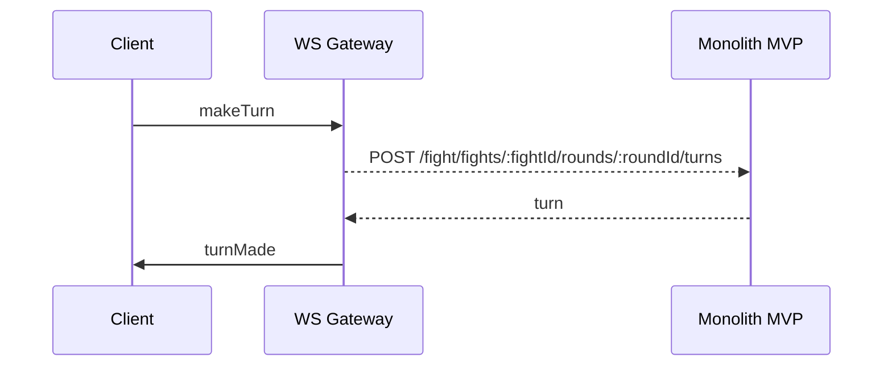

---

### Profile

**loadProfile**

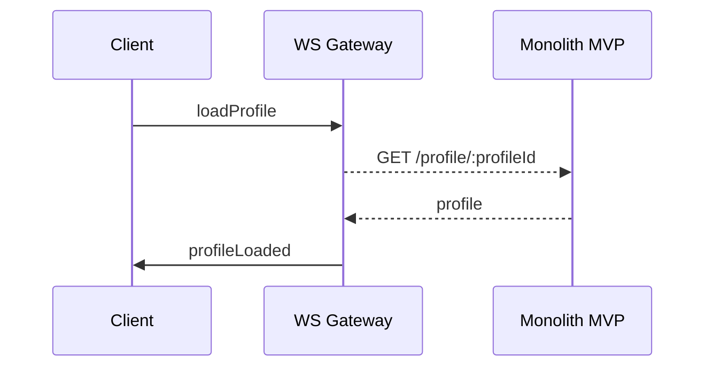

---

### Error messages

Each event can fail!

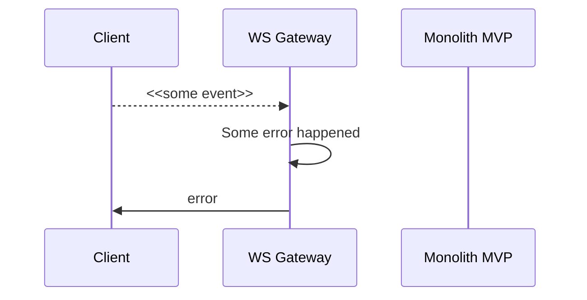
